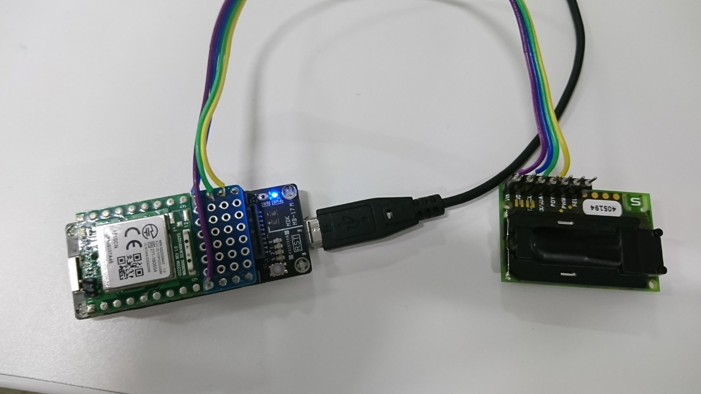

#SCD30 CO2 Sensor Library
===========================================================
This driver is for SCD30 CO2 Sensor breakout boards which are connected through the Arduino I2C.
Derived from the SparkFun SCD30 CO2 Sensor Board for the Arduino.

SparkFun driver repository: https://github.com/sparkfun/SparkFun_SCD30_Arduino_Library

SCD30 CO2 Sensor: https://www.sensirion.com/environmental-sensors/carbon-dioxide-sensors-co2/

Repository Contents
-------------------

* **/examples** - Example sketches for the library (.ino). Run these from the Arduino IDE. 
* **/src** - Source files for the library (.cpp, .h).
* **keywords.txt** - Keywords from this library that will be highlighted in the Arduino IDE. 
* **library.properties** - General library properties for the Arduino package manager. 

Documentation
--------------

* **[Installing an Arduino Library Guide](https://learn.sparkfun.com/tutorials/installing-an-arduino-library)** - Basic information on how to install an Arduino library.

License Information
-------------------

This product is _**open source**_! 

Various bits of the code have different licenses applied. Anything SparkFun wrote is beerware; if you see me (or any other SparkFun employee) at the local, and you've found our code helpful, please buy us a round! 

Please use, reuse, and modify these files as you see fit. Please maintain attribution to SparkFun Electronics and release anything derivative under the same license.

Distributed as-is; no warranty is given.

- Your friends at SparkFun.
